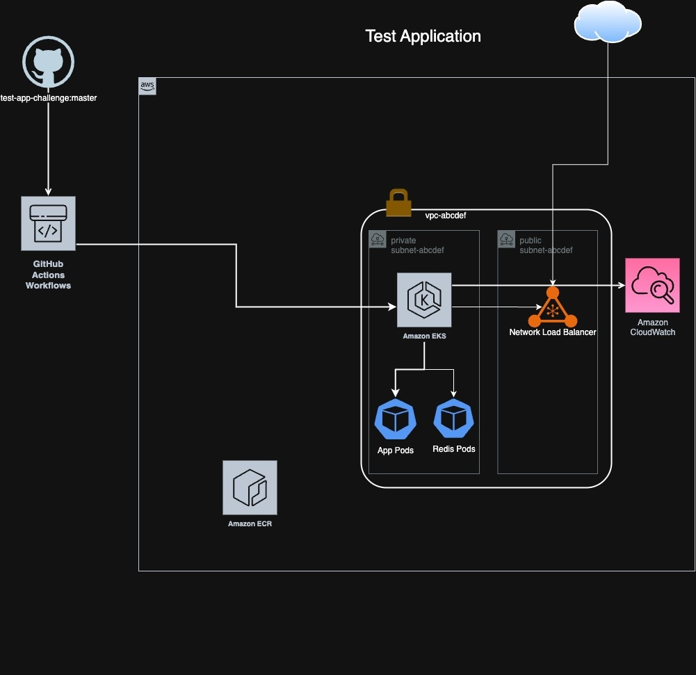
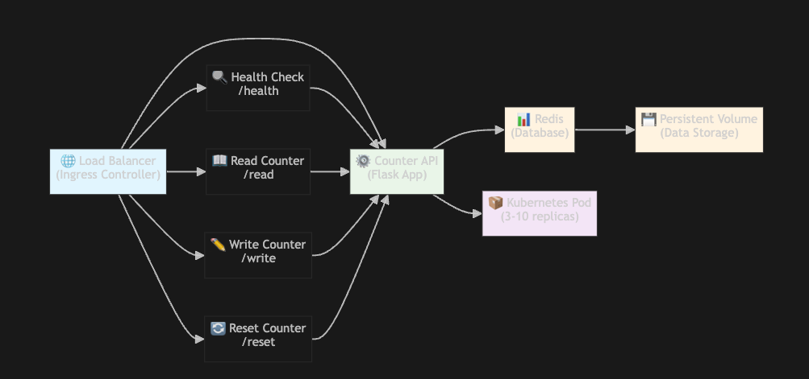

# Counter API - Platform Engineering Challenge

A production-ready REST API that implements a counter service with Redis persistence, containerization, Kubernetes deployment and GitHub actions.

## Features

- **RESTful API**: Clean endpoints for reading and writing counter values
- **Redis Integration**: Persistent storage with connection retry logic
- **Containerized**: Docker-based deployment with multi-stage builds
- **Kubernetes Ready**: Complete K8s manifests with autoscaling
- **Production Ready**: Health checks, monitoring, and error handling
- **CI/CD Pipeline**: GitHub Actions for automated testing and deployment
- **Security**: Non-root containers, vulnerability scanning, and secure defaults
- **Scalable**: Horizontal Pod Autoscaling and load balancing

## API Endpoints

| Method | Endpoint | Description |
|--------|----------|-------------|
| GET    | `/health` | Health check endpoint |
| GET    | `/read`   | Read current counter value |
| POST   | `/write`  | Increment counter by 1 |
| POST   | `/reset`  | Reset counter to 0 |

### Example API Usage

```bash
# Health check
curl https://application-redis.notadevopsengineer.com/health -H "X-API-Key: nXj..."

# Read counter
curl https://application-redis.notadevopsengineer.com/read -H "X-API-Key: nXj..."

# Increment counter
curl -X POST https://application-redis.notadevopsengineer.com/write -H "X-API-Key: nXj..."

# Reset counter
curl -X POST https://application-redis.notadevopsengineer.com/reset -H "X-API-Key: nXj..."
```

## Architecture

### System Overview


### Detailed Architecture


## Prerequisites

- Docker
- Kubernetes cluster (minikube, kind, or cloud provider)
- kubectl configured
- Python 3.11+ (for local development)

## Project Structure

```
counter-api/
├── app.py                      # Main Flask application
├── requirements.txt            # Python dependencies
├── Dockerfile                  # Container image definition
├── README.md                   # Documentation
├── .dockerignore              # Docker build ignore patterns
├── .github/                   # GitHub Actions workflows
├── k8s/                       # Kubernetes manifests
│   ├── namespace.yaml
│   ├── redis-deployment.yaml
│   ├── redis-service.yaml
│   ├── app-deployment.yaml
│   ├── app-service.yaml
│   └── ingress.yaml
├── scripts/                   # Deployment and utility scripts
│   ├── deploy.sh              # Main deployment script
│   ├── setup-aws.sh           # AWS infrastructure setup with fix capabilities
│   ├── simple-deploy.sh       # Simple deployment
│   └── check-status.sh        # Status checker
└── tests/                     # Test files
    └── test_app.py
```

## Quick Start

### Local Development

1. **Clone the repository**:
   ```bash
   git clone <repository-url>
   cd counter-api
   ```

2. **Start Redis locally**:
   ```bash
   docker run -d -p 6379:6379 redis:7-alpine
   ```

3. **Install dependencies**:
   ```bash
   pip install -r requirements.txt
   ```

4. **Run the application**:
   ```bash
   python app.py
   ```

5. **Test the API**:
   ```bash
   curl http://localhost:5000/health
   curl http://localhost:5000/read
   curl -X POST http://localhost:5000/write
   ```

### Production API

The production API is deployed and available at:

```bash
# Health check
curl https://application-redis.notadevopsengineer.com/health

# Read counter
curl https://application-redis.notadevopsengineer.com/read

# Increment counter
curl -X POST https://application-redis.notadevopsengineer.com/write

# Reset counter
curl -X POST https://application-redis.notadevopsengineer.com/reset
```

### Docker Deployment

1. **Build the Docker image**:
   ```bash
   docker build -t counter-api .
   ```

2. **Run with Docker Compose**:
   ```bash
   cat << EOF > docker-compose.yml
   version: '3.8'
   services:
     redis:
       image: redis:7-alpine
       ports:
         - "6379:6379"
     
     counter-api:
       image: counter-api
       ports:
         - "5000:5000"
       environment:
         - REDIS_HOST=redis
         - REDIS_PORT=6379
       depends_on:
         - redis
   EOF
   
   docker-compose up -d
   ```

## Kubernetes Deployment

### Using the Deployment Script

The easiest way to deploy is using the provided deployment script:

```bash
# Make the script executable
chmod +x scripts/deploy.sh

# Deploy to Kubernetes
./scripts/deploy.sh deploy

# Check deployment status
./scripts/deploy.sh status

# Run tests
./scripts/deploy.sh test

# Clean up
./scripts/deploy.sh cleanup
```

### Manual Deployment

1. **Create the namespace**:
   ```bash
   kubectl apply -f k8s/namespace.yaml
   ```

2. **Deploy Redis**:
   ```bash
   kubectl apply -f k8s/redis-deployment.yaml
   kubectl apply -f k8s/redis-service.yaml
   ```

3. **Build and load the application image**:
   ```bash
   docker build -t counter-api .
   # For minikube:
   minikube image load counter-api
   # For kind:
   kind load docker-image counter-api
   ```

4. **Deploy the application**:
   ```bash
   kubectl apply -f k8s/app-deployment.yaml
   kubectl apply -f k8s/app-service.yaml
   kubectl apply -f k8s/ingress.yaml
   ```

5. **Access the application**:
   ```bash
   # Port forward for testing
   kubectl port-forward -n counter-api service/counter-api-service 8080:80
   
   # Test the API
   curl http://localhost:8080/health
   curl http://localhost:8080/read
   curl -X POST http://localhost:8080/write
   
   # Or test the production API directly
   curl https://application-redis.notadevopsengineer.com/health
   curl https://application-redis.notadevopsengineer.com/read
   curl -X POST https://application-redis.notadevopsengineer.com/write
   ```

## Exposing to Public Internet

### Option 1: Ingress Controller (Recommended)

1. **Install NGINX Ingress Controller**:
   ```bash
   kubectl apply -f https://raw.githubusercontent.com/kubernetes/ingress-nginx/controller-v1.8.2/deploy/static/provider/cloud/deploy.yaml
   ```

2. **Configure DNS**:
   - Update the `host` field in `k8s/ingress.yaml`
   - Point your domain to the ingress controller's external IP

3. **Apply the ingress**:
   ```bash
   kubectl apply -f k8s/ingress.yaml
   ```

### Option 2: LoadBalancer Service

```bash
kubectl apply -f k8s/ingress.yaml
kubectl get service counter-api-loadbalancer -n counter-api
```

## CI/CD Pipeline

### GitHub Actions Setup

1. **Create GitHub Secrets**:
   - `AWS_ACCESS_KEY_ID`: AWS access key
   - `AWS_SECRET_ACCESS_KEY`: AWS secret key

2. **Update configuration**:
   - Edit `.github/workflows/deploy.yml`
   - Update `AWS_REGION`, `ECR_REPOSITORY`, and `EKS_CLUSTER_NAME`

3. **AWS Infrastructure**:
   ```bash
   # Create ECR repository
   aws ecr create-repository --repository-name counter-api --region us-east-1
   
   # Create EKS cluster (example)
   eksctl create cluster --name counter-api-cluster --region us-east-1
   ```

4. **Push to main branch**:
   ```bash
   git add .
   git commit -m "Initial deployment"
   git push origin main
   ```

### Available Scripts

All deployment and utility scripts are located in the `scripts/` directory:

- `scripts/deploy.sh` - Main deployment script with multiple commands
- `scripts/setup-aws.sh` - AWS EKS cluster and ECR setup with fix capabilities
- `scripts/check-status.sh` - Check deployment status

The `setup-aws.sh` script now includes a `fix` command that can resolve common installation issues.

## Monitoring and Observability

### Health Checks

The application includes comprehensive health checks:

- **Liveness Probe**: Checks if the application is running
- **Readiness Probe**: Checks if the application can serve traffic
- **Health Endpoint**: `/health` provides detailed status

### Metrics

For production monitoring, consider integrating:

- **Prometheus**: For metrics collection
- **Grafana**: For visualization
- **Jaeger**: For distributed tracing

### Logging

The application provides structured logging:

```python
# Example log output
2023-12-01 10:00:00 - app - INFO - Reading counter value
2023-12-01 10:00:00 - app - INFO - Counter value read: 42
```

## Configuration

### Environment Variables

| Variable | Default | Description |
|----------|---------|-------------|
| `REDIS_HOST` | `localhost` | Redis hostname |
| `REDIS_PORT` | `6379` | Redis port |
| `REDIS_DB` | `0` | Redis database number |
| `REDIS_PASSWORD` | `None` | Redis password |
| `PORT` | `5000` | Application port |
| `API_KEU` | `string` | API KEY used for Auth |
| `DEBUG` | `false` | Enable debug mode |

### Redis Configuration

The Redis deployment includes:

- **Persistence**: Data is persisted to disk
- **Memory Management**: LRU eviction policy
- **Monitoring**: Health checks and resource limits

## Scaling Considerations

### Horizontal Scaling

The application is designed for horizontal scaling:

1. **Stateless Design**: No application state stored locally
2. **Redis Clustering**: Use Redis Cluster for high availability
3. **Load Balancing**: Requests distributed across multiple pods
4. **Auto-scaling**: HPA scales based on CPU/memory usage

### Vertical Scaling

Adjust resource limits in `k8s/app-deployment.yaml`:

```yaml
resources:
  requests:
    memory: "128Mi"
    cpu: "100m"
  limits:
    memory: "512Mi"
    cpu: "500m"
```

### Handling Increased Demand

1. **Auto-scaling**: HPA automatically scales from 3 to 10 replicas
2. **Resource Optimization**: Gunicorn with multiple workers
3. **Redis Optimization**: Connection pooling and persistent connections
4. **Caching**: Application-level caching for frequently accessed data

## Security

### Container Security

- **Non-root user**: Application runs as non-root user
- **Read-only filesystem**: Root filesystem is read-only
- **Security contexts**: Restricted security contexts
- **Image scanning**: Trivy vulnerability scanning in CI/CD

### Network Security

- **Network policies**: Restrict pod-to-pod communication
- **TLS/SSL**: HTTPS termination at ingress
- **Rate limiting**: Request rate limiting

### Authentication & Authorization

For production deployments, consider:

- **API Keys**: Implement API key authentication
- **OAuth2**: Use OAuth2 for user authentication
- **RBAC**: Role-based access control

## Testing

### Unit Tests

```bash
# Install test dependencies
pip install pytest pytest-cov

# Run tests
pytest tests/ -v --cov=app

# Run tests with coverage
pytest tests/ -v --cov=app --cov-report=html
```

### Integration Tests

```bash
# Start Redis for integration tests
docker run -d -p 6379:6379 redis:7-alpine

# Run integration tests
pytest tests/test_app.py::TestIntegration -v
```

### Load Testing

```bash
# Install Apache Bench
sudo apt-get install apache2-utils

# Basic load test
ab -n 1000 -c 10 http://localhost:5000/read

# Write load test
ab -n 1000 -c 10 -p /dev/null -T application/json http://localhost:5000/write
```

## Troubleshooting

### Common Issues

1. **Redis Connection Error**:
   ```bash
   # Check Redis service
   kubectl get pods -n counter-api
   kubectl logs -n counter-api deployment/redis
   ```

2. **Application Not Starting**:
   ```bash
   # Check application logs
   kubectl logs -n counter-api deployment/counter-api
   ```

3. **Ingress Not Working**:
   ```bash
   # Check ingress controller
   kubectl get pods -n ingress-nginx
   kubectl describe ingress -n counter-api
   ```

### Debugging Commands

```bash
# Get all resources
kubectl get all -n counter-api

# Describe deployment
kubectl describe deployment counter-api -n counter-api

# Get events
kubectl get events -n counter-api --sort-by=.metadata.creationTimestamp

# Port forward for debugging
kubectl port-forward -n counter-api service/counter-api-service 8080:80
```

## Additional Resources

- [Flask Documentation](https://flask.palletsprojects.com/)
- [Redis Documentation](https://redis.io/documentation)
- [Kubernetes Documentation](https://kubernetes.io/docs/)
- [Docker Best Practices](https://docs.docker.com/develop/dev-best-practices/)

# To do
- Add TLS/SSL on the endpoints via ACM and ALB Controller
- Implement Terraform for the infrastucture
- Implement Monitoring and Alerting for the services and infrastructure
- Implement Helm for deployment
- Implement ArgoCD